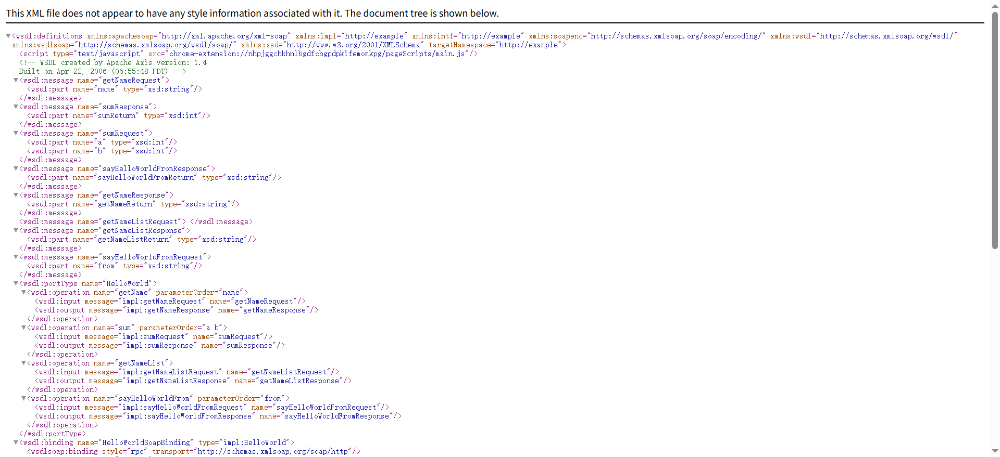
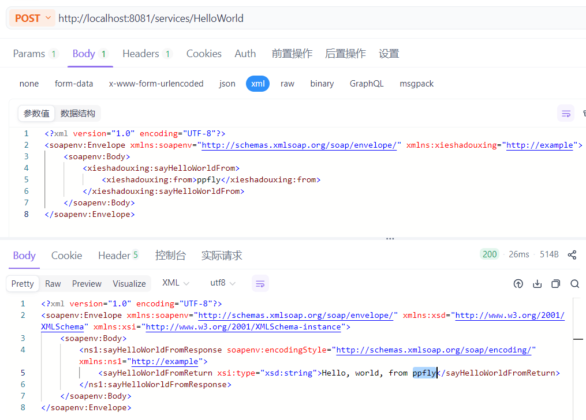
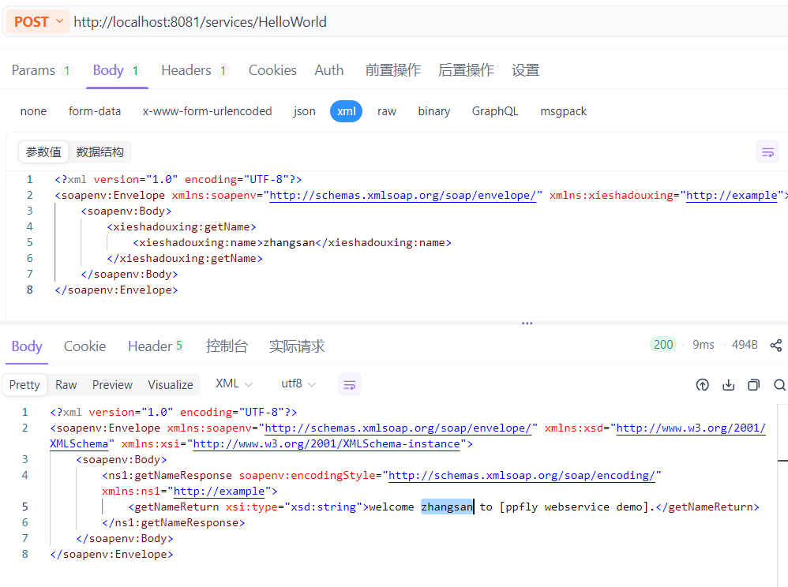
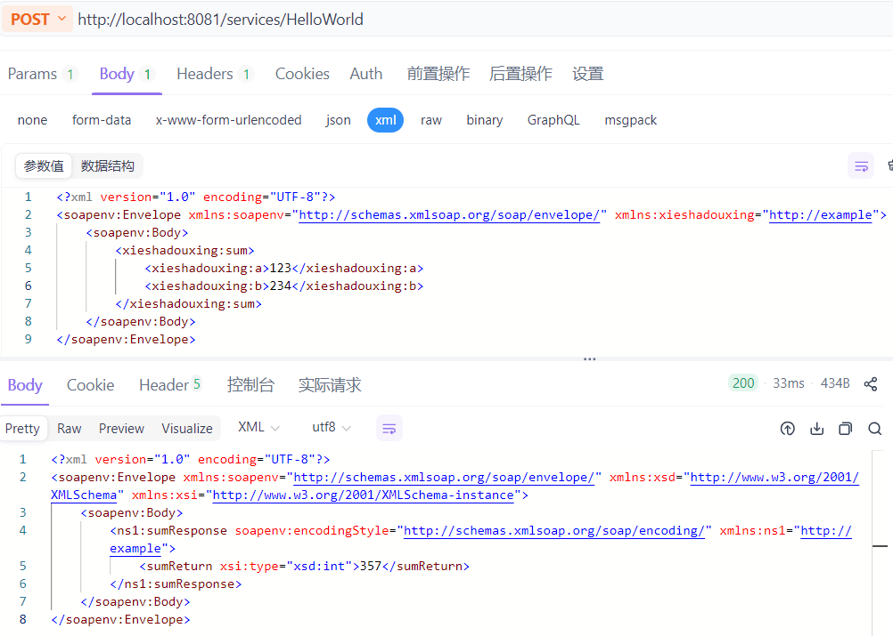

## 0. 项目说明
创建WebService项目，主要目的是作为Postman、soapUI等工具进行soap webservice 接口测试的案例

## 1. tomcat配置


## 2. 访问应用
### 2.1 查看所有services
http://localhost:8081/services


### 2.2 查看HelloWorld service
点击HelloWorld的(wsdl)，进入[http://localhost:8081/services/HelloWorld?wsdl](http://localhost:8081/services/HelloWorld?wsdl)


## 3. 测试说明
### 3.1 HelloWorld.wsdl
该文件为Web Services Description Language，用于说明HelloWorld webservice服务的描述：
* 提供了哪些操作（operation）
* 每个操作的输入/输出消息格式（XML 元素）
* 这些操作通过什么网络地址、用什么协议（SOAP/HTTP）访问
该文件可通过访问[http://localhost:8081/services/HelloWorld?wsdl](http://localhost:8081/services/HelloWorld?wsdl)生成查看

### 3.2 postman_collection
postman接口测试
#### 3.2.1 sayHelloWorldFrom
```xml
<?xml version="1.0" encoding="UTF-8"?>
<soapenv:Envelope xmlns:soapenv="http://schemas.xmlsoap.org/soap/envelope/" xmlns:xieshadouxing="http://example">
    <soapenv:Body>
        <xieshadouxing:sayHelloWorldFrom>
            <xieshadouxing:from>ppfly</xieshadouxing:from>
        </xieshadouxing:sayHelloWorldFrom>
    </soapenv:Body>
</soapenv:Envelope>
```


#### 3.2.2 getName
```xml
<?xml version="1.0" encoding="UTF-8"?>
<soapenv:Envelope xmlns:soapenv="http://schemas.xmlsoap.org/soap/envelope/" xmlns:xieshadouxing="http://example">
    <soapenv:Body>
        <xieshadouxing:getName>
            <xieshadouxing:name>zhangsan</xieshadouxing:name>
        </xieshadouxing:getName>
    </soapenv:Body>
</soapenv:Envelope>
```


#### 3.2.3 getName
```xml
<?xml version="1.0" encoding="UTF-8"?>
<soapenv:Envelope xmlns:soapenv="http://schemas.xmlsoap.org/soap/envelope/" xmlns:xieshadouxing="http://example">
    <soapenv:Body>
        <xieshadouxing:sum>
            <xieshadouxing:a>123</xieshadouxing:a>
            <xieshadouxing:b>234</xieshadouxing:b>
        </xieshadouxing:sum>
    </soapenv:Body>
</soapenv:Envelope>
```

